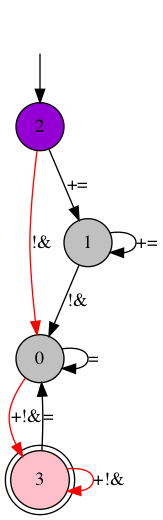

# Графическое отображение работы ДКА

## Суть проекта  
Пользователь вводит в специальное окошко имя файла, где содержится описание Детерменированного конечного автомата (правила языка описания автоматов ниже), а также строку, которую хочет проверить на принадлежность языку, задаваемому введенным ДКА. 

Далее есть возможность получить графическое представление введенного ДКА. (Кнопка `Show automate`)

Более того, если строка принадлежит языку, можно вывести рисунок, показывающий по каким ребрам прошла строка. Если же строка не принадлежит языку, появляется окошко, сообщающее пользователю данную информацию. (Кнопка `Show validation`)

## Язык описания ДКА  
* Общие правила:
    + все числа оборачиваются в (..)
    + ключевые слова языка: alphabet, Q (количество состояний), start (начальное состояние), T (терминальные состояния), function (ребра с функцией перехода на них)
* Перечисляем алфавит языка автомата. Под капотом строим биекцию символов алфавита с натуральными числами. Например, если язык автомата {a,b}, то a -> 1, b -> 2. Далее 2 разделительных символа '||'.
* Номер вершины - стартового состояния
* Номера вершин - терминальных состояний
* Количество ребер, далее описание всех ребер автомата по принципу: (номер состояния - начала ребра)(номер состояния - конца ребра)(описание функции перехода по этому ребру). Описание функции перехода по ребру: мы строим биекцию между алфавитом языка автомата и натуральными числами и просто кодируем числами все символы языка автомата, по которым можно сделать переход в данном месте. Описание каждого ребра заканчивается символом "."


## Запуск приложения
### Прежде всего, понадобится установить некоторые библиотеки для запуска приложения  
* PyGraphviz  
[Рекомендации по установке можно найти тут](https://pygraphviz.github.io/documentation/stable/install.html)  
* Matplotlib  
[Рекомендации по установке можно найти тут](https://matplotlib.org/stable/users/installing.html)
* Networkx  
[Рекомендации по установке можно найти тут](https://networkx.org/documentation/stable/install.html)
* Tkinter

### Готовы к запуску
```
python main.py

```
А дальше следуем инструкциям в появившемся окошке!)

## Пример работы
Окошко, куда можно ввести имя файла, где хранится автомат и строку, которую мы хотим провалидировать:


Сам код ДКА и его графическое представление: 
```javascript
alphabet:+=!& ||Q:(4) start:(2) T:(3) function:(2)(1)(1)(2).(1)(1)(1)(2).(1)(0)(3)(4).(2)(0)(3)(4).(0)(0)(2).(0)(3)(1)(3)(4).(3)(3)(1)(3)(4).(3)(0)(2).
```


Строка и визуализация её прохода по ДКА:
```javascript
+!&
```




